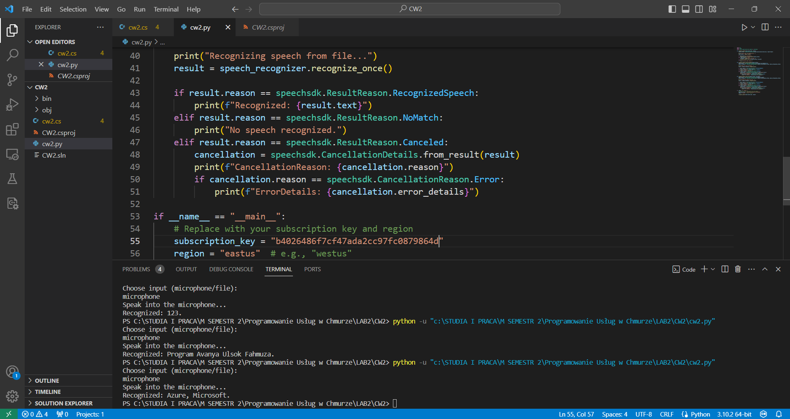

# Programowanie Uslug w Chmurze - Sprawozdanie z Laboratorium 2
Podczas niniejszego laboratorium wykonano kilka ćwiczeń związanych z usługami Azure polegających na sztucznej inteligencji. Do wykonania ćwiczeń starano się wykorzystać na początku środowisko programistyczne Visual Studio Community oraz język C#. Niestety po prawidłowym zainstalowaniu i skonfigurowaniu środowiska, dołączenia paczek, m.in. paczki 'Microsoft.Azure.CognitiveServices' poprzez system do zarządzania pakietami NuGet i napisaniu kodu do pierwszego ćwiczenia, nie można było połączyć się z usługą, jak pokazano niżej na zdjęciu. W związku z tym przeniesiono się na środowisko Visual Studio Code oraz język Python.

## Ćwiczenie: Azure Bing Search
Do wykonania ćwiczenia wykorzystano usługę Bing Search, dostępną na platformie chmurowej Azure. Po zakupieniu zasobu, skopiowano klucz dostępu oraz endpoint, za pomocą których połączono się z usługą.

Kolejnym krokiem było napisanie kodu, który łączy się z usługą, zadaje jej pytanie, a następnie zczytuje odpowiedzi. Odpowiedzi zwracano do terminala.

Ulepszeniem kodu było zaimplementowanie wyboru typu zwracanej informacji (strony internetowe, zdjęcia lub wiadomości.

Finalnie, stworzono interfejs użytkownika, który pozwalał na wprowadzenie szukanej frazy oraz wybór typu wiadomości. Wykorzystany kod znajduje się w pliku 'bing_search.py'.

## Ćwiczenie: Azure Speech Service
W następnym ćwiczeniu, wykorzystano usługi do konwersji tekstu mówionego na tekst pisany i odwrotnie. Na początku stworzono kod, który zamienia mowę na tekst pisany w języku angielskim.

Następnie odwrócono proces i usługa Azura czytała wprowadzony tekst w języku o zadeklarowanej w kodzie płci. Użyty kod znajduje się w pliku 'speech.py'.

Finalnie, starano się zaimplementować usługę tłumaczenia tekstu mówionego na żywo, lecz niestety usługa nie zawsze wykrywała dźwięk.

## Ćwiczenie: Azure Form Recognizer
W ćwiczeniu związanym z czytaniem zawartości dokumentu wykorzystano przykładowy dokument, pokazany poniżej.

Na potrzeby ćwiczenia zaimplementowano kod 'form.py', który zczytuje zawartość dokumentu oraz zwraca prawdopodobieństwo rozpoznania słowa, pola lub innego elementu na dokumencie. Kod przetestowano na pliku wyżej.

Usprawnieniem do kodu jest zwracanie najważniejszych odczytanych elementów dokumentu do pliku JSON, tak aby można było go użyć w dalszej części procesu.

## Ćwiczenie: Azure QnA
